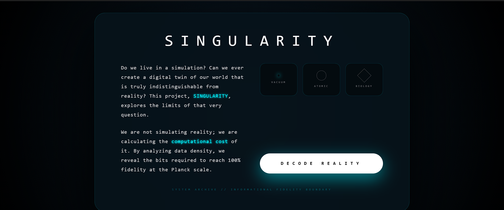
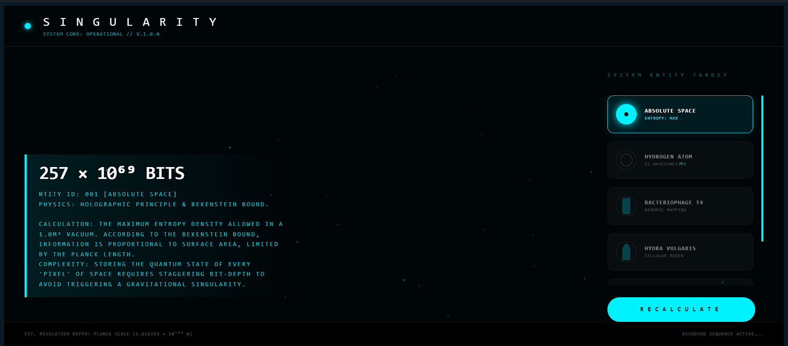
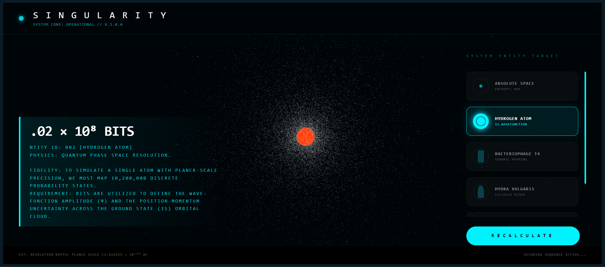

# Singularity
A hypothetical calculation of how many bits it would take to encode reality, fragments of reality named as "system entity targets" in this project.

## What is this?
SINGULARITY calculates how many bits of information are contained in different 
physical systems ,be it atoms, cells, vacuum space and many simple organisms or systems using real physics equations.

The project explores a fundamental question: if reality is information, 
how much information is needed to describe it completely?

By visualizing atoms, vacuum, and biological structures, it shows the complexity hidden in everyday things and that how much impossible it is to exactly simulate reality or even a fragment of it.

It's a hypothetical exercise asking what's the data footprint of reality?

## Why Use Singularity?

Singularity is a small interactive project that explores a simple but difficult question like:

**What would it actually cost to represent reality with perfect accuracy?**

Using ideas from physics, information theory, and computer science, the project examines roughly or tries to examine how much information may be required to describe different systems ,from empty space and atoms to more complex biological structures.

### What can you explore?

- See how much information different systems may require to be represented accurately (simulate)
- Compare simple systems like empty space or atoms with more complex biological structures.
- Explore how physics, computation, and data may be connected.
- Think about bigger questions like digital twins, simulation theory, and the limits of computation.
## Screenshots

## Live Demo

## How to Run Locally
### Requirements
- Node.js  → Download from [nodejs.org](https://nodejs.org)
- Gemini API key  → [aistudio.google.com](https://aistudio.google.com)

### steps  
1. Clone the repository:
git clone https://github.com/Hawra05/Singularity.git 

2. Install dependencies:
npm install

3. Create a `.env.local` file in the root folder and add:
VITE_GEMINI_API_KEY=your_gemini_api_key_here

4. Run the project:
npm run dev

5. Open your browser and go to `http://localhost:3000/`
